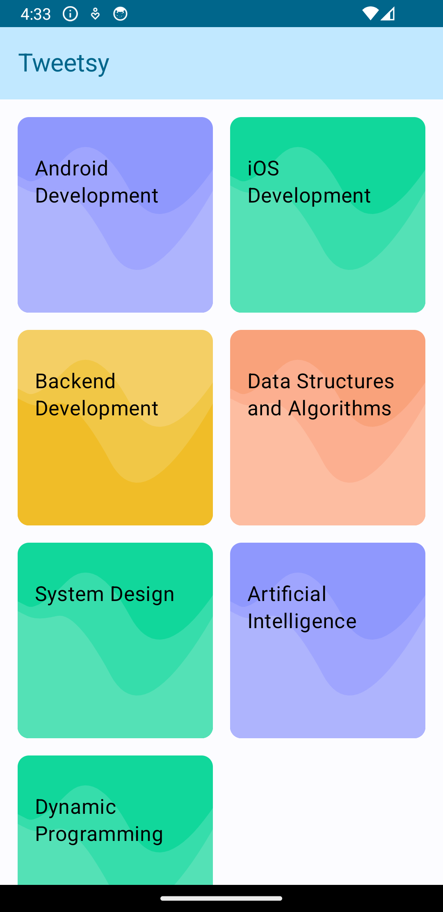
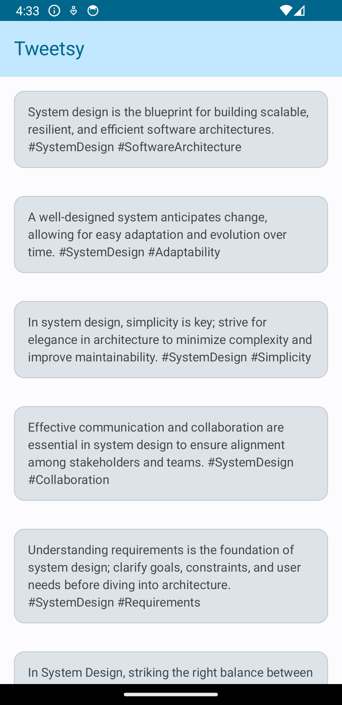

# Compose-Tweets-App

## Description

Compose-Tweets-App is an Android application built with **Kotlin** and **Jetpack Compose**. It focuses on creating a Twitter-like experience with features such as composing tweets, viewing tweets, and navigation between different screens. The app follows the **MVVM architecture** pattern and utilizes **Hilt Dependency Injection** for managing dependencies. Asynchronous programming is handled using **Coroutines** and **Flow**.

### Technologies Used:

- **Kotlin**
- **Jetpack Compose**
- **Compose Navigation**
- **Coroutines**
- **Flow**
- **Hilt Dependency Injection**
- **MVVM**
- **Clean Code Architecture**

Compose-Tweets-App showcases best practices in Android development by leveraging these technologies.

## Screenshots

 

## Table of Contents

- [Installation](#installation)
- [Usage](#usage)
- [Contributing](#contributing)
- [License](#license)

## Installation

1. Clone the repository:
git clone https://github.com/rahulgothwal5/Compose-Tweets-App.git
2. Open the project in Android Studio.

## Usage

Explore the codebase to learn how to develop an Android application using **Jetpack Compose** for building modern UIs, **MVVM architecture** for structuring the app's codebase, and **Hilt Dependency Injection** for managing dependencies. Asynchronous programming is handled efficiently using **Coroutines** and **Flow**. The app simulates Twitter-like functionality by fetching tweets from the Faker API and displaying them based on the topic.

## Contributing

1. Fork the repository.
2. Create a new branch (`git checkout -b feature/your-feature-name`).
3. Make your changes.
4. Commit your changes (`git commit -am 'Add new feature'`).
5. Push to the branch (`git push origin feature/your-feature-name`).
6. Create a new Pull Request.

## License

This project is licensed under the [MIT License](LICENSE).
